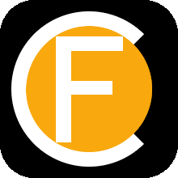
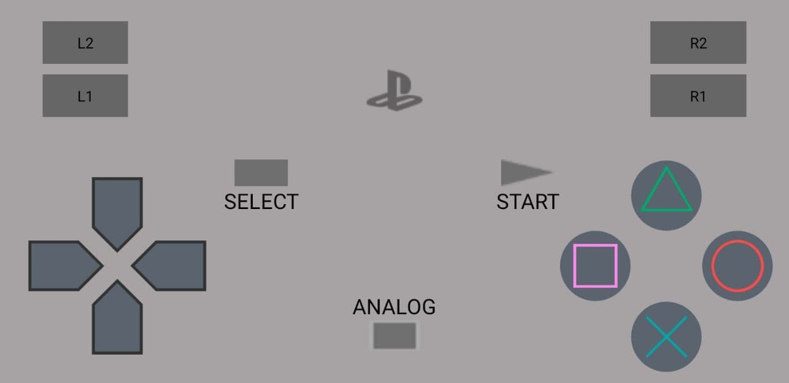
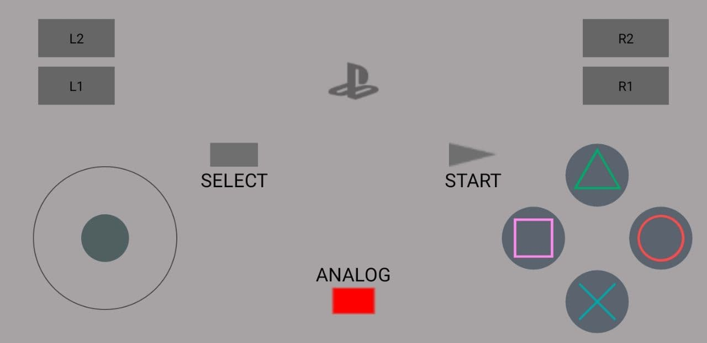

# FreakController

  

Use your phone as a game controller! 

This project has two parts, an Android application with the controller and a NodeJS server that needs to be ran in the computer.

Screenshots of the app:

The PS button on the center opens the settings, to configure Host IP address, port and mode (different key mappings).